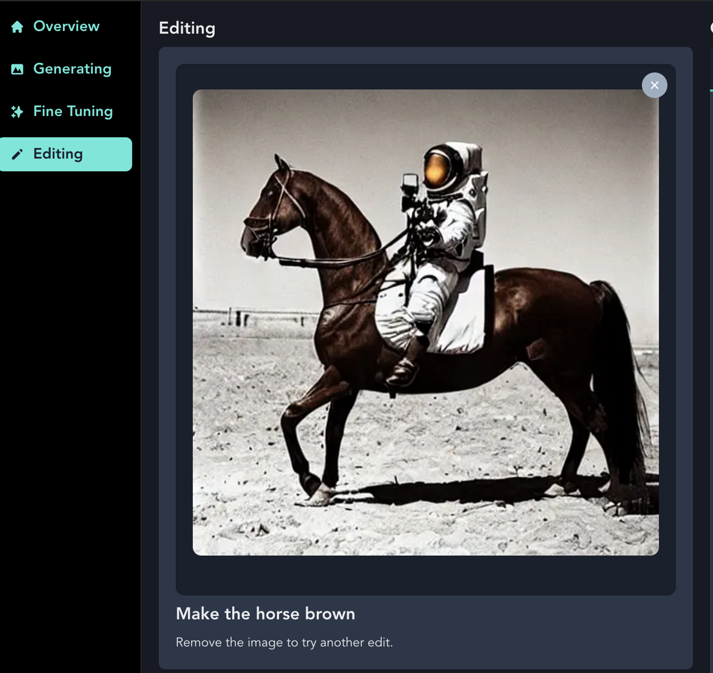

# Generating Images Using Javascript / Typescript SDK

## Overview

Do you want to use AI to generate an image with just a few lines of code? That’s what we’re building this guide. To get started, all you need is a Leap account and a little Typescript knowledge. We’re going to use the Leap SDK to generate an image. This is the simplest way to integrate image generation into any app or project you are working on. Let’s jump into it ☺️

## Set-Up

Head over to the [Leap homepage](https://www.leapml.dev/) and create an account. Then, open up your terminal and initialize a new project with this command:

`npm init`

Install the Leap SDK with the following command:

`npm i @leap-ai/sdk`

The project should now have a `node_modules` folder, a `package.json`, and a `package-lock.json`. Let’s get started with the image generation.

## Generate an Image

In the root of the project, create a new file called `generate.ts`. This is where we will generate an image. Start off by importing the Leap SDK and creating an empty function called `main`.

```ts
import { Leap } from '@leap-ai/sdk'

const main = async () => {}

main();
```

Inside the `main` function:

- instantiate the SDK
- create a new variable to hold your prompt
- pass that `prompt` into the `generateImage` method

It should look like this:

```ts
import { Leap } from '@leap-ai/sdk';

const main = async () => {

  // You can find your API in the Leap dashboard in the bottom left corner
	const leap = new Leap('<YOUR_API_KEY>')

	// This can be any string
  const prompt = 'A photo of an astronaut riding a horse';

  const { data, error } = await leap.generate.generateImage({ prompt });

  console.log('Data -->>', data);
}

main();
```

Don’t forget to replace `<YOUR_API_KEY>` with your actual API key.

Now. The moment of truth. Run your file with the following command:

`npx ts-node generate.ts`

Check your console for the log of the `data` object that is returned. It will be similar to the example below:

```bash
{
  id: 'e2448b0f-d5b7-4e1f-80a5-cad5f9c57638',
  state: 'finished',
  prompt: 'A photo of an astronaut riding a horse',
  negativePrompt: '',
  seed: 97287,
  width: 512,
  height: 512,
  numberOfImages: 1,
  steps: 50,
  weightsId: '8b1b897c-d66d-45a6-b8d7-8e32421d02cf',
  workspaceId: 'c70245a0-79c2-4e7d-9430-e1cf89f61fbb',
  createdAt: '2023-02-13T09:34:24.896427+00:00',
  promptStrength: 7,
  images: [
    {
      id: 'e90d8893-07af-4bbc-a11f-a0b3b74ff2ce',
      uri: '<https://dreamtrain.s3.us-west-2.amazonaws.com/image-gen-e2448b0f-d5b7-4e1f-80a5-cad5f9c57638/generated_images/0.png>',
      createdAt: '2023-02-13 09:34:37.912485+00'
    }
  ],
  modelId: '8b1b897c-d66d-45a6-b8d7-8e32421d02cf'
}
```

A link to the image that was generated can be found in `data.images[0].uri`. [Here](https://dreamtrain.s3.us-west-2.amazonaws.com/image-gen-e2448b0f-d5b7-4e1f-80a5-cad5f9c57638/generated_images/0.png) is the image we generated when writing this guide.


Awesome 🎉 You just generated an image using the Leap SDK. Let your mind start to wander and imagine the possibilities. If it is this easy to spin up an image generator, what else can you build? Tell us about it, or show it off in the [Leap Discord](https://discord.com/invite/NCAKTUayPK).

## Next Steps

Okay. So image generation is cool, but what if you want to change one or two things about the image that was generated?

In the Leap dashboard, go to the `Editing` tab and use AI to edit the image. Yeah, that’s exactly as mind-blowing as it sounds 🤯



Thanks for building with us. If you have any questions, the whole team is waiting for you in the [Leap Discord](https://discord.com/invite/NCAKTUayPK). You can also find us on Twitter - [@leap\_api](https://twitter.com/leap_api).